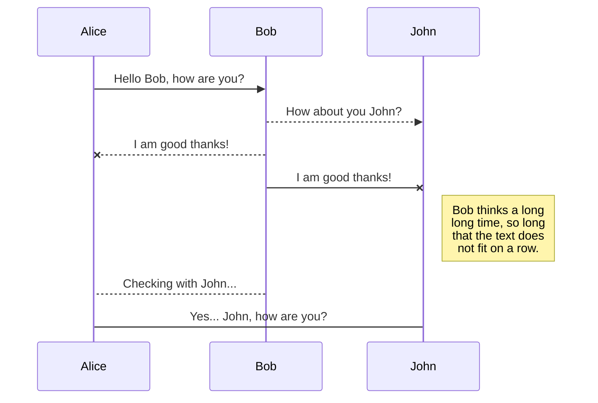
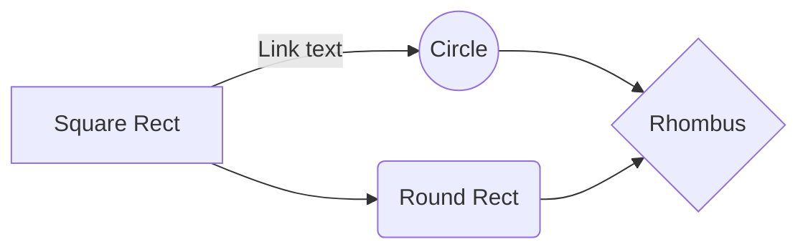
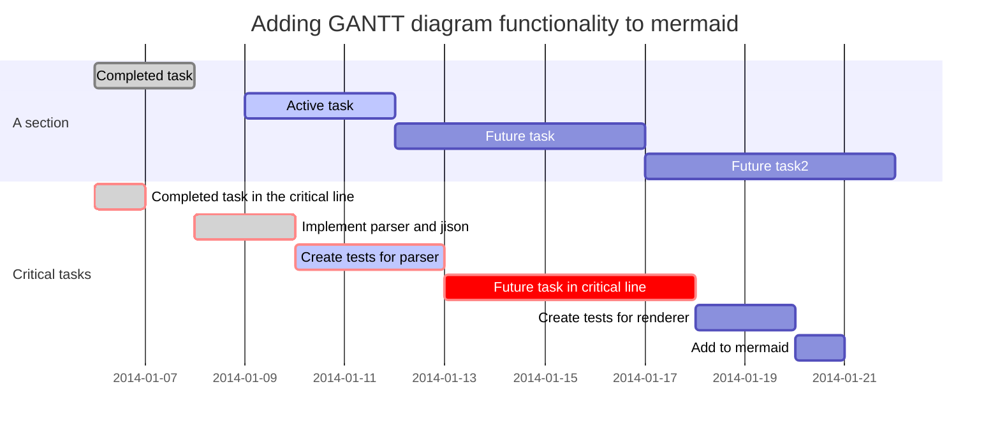

```mermaid
sequenceDiagram
Alice ->> Bob: Hello Bob, how are you?
Bob-->>John: How about you John?
Bob--x Alice: I am good thanks!
Bob-x John: I am good thanks!
Note right of John: Bob thinks a long<br/>long time, so long<br/>that the text does<br/>not fit on a row.

Bob-->Alice: Checking with John...
Alice->John: Yes... John, how are you?
```

```mermaid
graph LR
A[Square Rect] -- Link text --> B((Circle))
A --> C(Round Rect)
B --> D{Rhombus}
C --> D
```

```mermaid
gantt
        dateFormat  YYYY-MM-DD
        title Adding GANTT diagram functionality to mermaid
        section A section
        Completed task            :done,    des1, 2014-01-06,2014-01-08
        Active task               :active,  des2, 2014-01-09, 3d
        Future task               :         des3, after des2, 5d
        Future task2               :         des4, after des3, 5d
        section Critical tasks
        Completed task in the critical line :crit, done, 2014-01-06,24h
        Implement parser and jison          :crit, done, after des1, 2d
        Create tests for parser             :crit, active, 3d
        Future task in critical line        :crit, 5d
        Create tests for renderer           :2d
        Add to mermaid                      :1d
```

테스트중입니다.
테스트중2